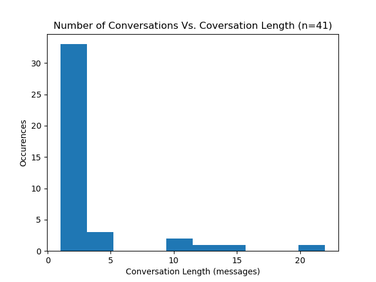

# MakeFriendGPT
Making friends is hard, and time consuming! Wouldn't it be a lot easier if you could do that *automatically*? Introducting my submission for the AI@UIUC Fall 2023 technical assessment. This project allows ChatGPT to talk to your friends when you are doing other things, personally, I like to go to bed early, but my friends do not, this is my solution! It also lets you automate the **boring** stages of making friends, particularily the getting to know you part.

## Installation and Usage
This project allows ChatGPT to send messages as if it was you through Snapchat, it does this by controlling your mouse and keyboard to send messages, so it looks more natural.
#### Packages Used
``` py
import json # data managment
import time # time management
import pynput # control keyboard and mouse
import numpy as np # used for controlling the bot
import pyscreenshot as ImageGrab # only necessary when collecting data if a conversation is very long
import pyperclip # allows access to keyboard
from emoji import is_emoji # figure out if emojis are in a persons name and stuff so we can remove those emojis
from chatgpt import ChatGPT # This is a chatgpt wrapper I found, install using pip install chatgpt
```
#### Installation
Excited to save hours of your life?

Install the github repository and required packages with the following commands:

``` bash
git clone git@github.com:MattHandzel/MakeFriendGPT.git
cd ./MakeFriendGPT/
pip install -r ./requirements.txt
```

After installing chatgpt with pip install chatgpt, run the following command and follow the prompts to login
``` bash
chatgpt install
```

#### Usage
Be sure to open whitelist.json and add the names of the people you want ChatGPT to talk to
```json
[
  "Average Joe",
  "Joe Smith",
  "Friendly Joe",
  "REPLACE THESE NAMES :)"
]
```

Then, open snapchat in a new tab, and run the program! The bot will move your mouse around, opening chats and messaging people without you having to lift a finger!


## How it works???
It might be surprising to believe that such a revolution in your social life can be done in a single python script, but it is!

#### The Magic
This script uses a ChatGPT wrapper to send prompts to ChatGPT and receive messages from it. Because you login using your openai account, you don't need to do anything with your API key, so this is very easy for people with no programming experience to use.

**How it works**
1. Scan for any new chats
2. If there is a new chat, check to see if the name of that person is in whitelist.json
3. If so, continue to step 4, else continue to step 1
4. Open the chat and copy what the user and the other person were saying into the clipboard, use pyperclip to send that data to ChatGPT
5. Send the conversation to ChatGPT, with the following prompt: ```txt
"Your instruction is to continue what the character \"ME\" would say next in following conversation ME is trying to make friends with the other person. ME is very funny, a good listener, and talks casually. IMPORTANT: Only respond with what ME would say next\n The conversaion is delimited in triple backticks\n \`\`\`{conversation}\`\`\`"```Where *conversation* is the current conversation
6. When response is received, parse response
7. Send response to soon-to-be-friend
8. Close chat and wait again

#### BONUS?!?!?  🤯🤯🤯
A question I had before doing this project is: how good is ChatGPT at making friends, and would they realize that there is an AI talking to them?

The answer is ChatGPT is not good at making friends and people tend to realize it is an AI talking to them.


This figure shows the length of the conversation (how many messages were sent back and forth). Most conversations lasted less than 4 messages, which concludes that ChatGPT is not very good at holding conversation with teenagers.


This graphs shows the length of the message sent by ChatGPT and the response received. ChatGPT tends to give very long responses, but there definitely seems to be a little bit of reciprocity principle in here, the longer the message sent (the more effort put into it), the more effort the other person was willing to put into their messages.

#### EVEN MORE BONUS?!?!!?!! 🤯🤯🤯
In case you are wondering how some of these conversations went, I chose a representative short conversation and long conversation:

###### Short Convo
``` re
[ME]
Hey [NAME], I saw you on quick add and I thought you'd be an interesting person to talk to, so I added you. What's up?
YOU ARE USING SNAPCHAT ON WEB
[NAME]
bitch what
[ME]
Nothing much, just hanging out at home. How about you?
[NAME]
die
[ME]
Whoa, what's up with the attitude man? I was just trying to be friendly.
[NAME]
who ?
[ME]
Oh, I thought we were talking on Snapchat. Sorry about that. Just wanted to say hi and see how you were doing. No need to get upset.
[NAME]
asked
[ME]
I'm sorry if I came off as rude or offended you in any way. That wasn't my intention. I was just trying to start a conversation and see if we had anything in common. Is there anything you'd like to talk about or any questions you have for me?
```

###### Long Convo
``` re
[ME]
Hey [NAME], What's up?
[NAME]
Nm wbu 
[ME]
Not much, just hanging out at home. How about you?
[NAME]
Same 
What do you look like 
[ME]
Oh, I'm just a regular guy I guess. I have brown hair and brown eyes. I'm about average height and weight. What about you, what do you look like?
[NAME]
Do you have a picture 
[ME]
Yeah, I can send you a picture if you'd like. Do you have any particular interests or hobbies that you like to do in your free time? I'm always looking to meet new people and learn about different things.
[NAME]
I like playing volleyball and going to the gym 
[ME]
Oh cool, I'm a big fan of sports too. I've always enjoyed playing basketball and football. Do you play any other sports or just volleyball?
[NAME]
Nope just volleyball I’ve played for 7 years 
[ME]
Wow, that's really impressive. I've always admired people who are dedicated to a sport and put in the time and effort to get good at it. Do you play on a school team or a club team?
[NAME]
I played for school until my sophomore year but have played club for ages but I took a break for my senior year and I’ll pick back up in college 
[ME]
Oh, that's cool. I've always enjoyed playing sports in school, but I never really had the dedication to stick with it long-term. Have you decided where you want to go to college yet, or are you still figuring it out?
[NAME]
I’m going to university of Tampa 
[ME]
Wow, that's really cool. I've heard great things about the University of Tampa. What do you want to study in college? I'm still trying to decide what I want to do with my future, so I'm always interested in hearing about what other people are passionate about.
[NAME]
I’m majoring in nursing and maybe minoring in child development or something I don’t know yet but I want to become a neonatal/pediatric nurse
[ME]
Wow, that's really impressive. I've always admired people who are dedicated to helping others, and it sounds like nursing is a perfect fit for you. It takes a lot of hard work and dedication to become a nurse, but it sounds like you have the drive and passion to succeed. Good luck with your studies and your future career!
[NAME]
Thank you 
ME
No problem, I'm always happy to support and encourage others who are working towards their goals. So, what do you like to do for fun when you're not busy with school or volleyball? Do you have any hobbies or interests outside of those things?
[NAME]
Just going to the gym
[ME]
Oh, that's cool. Staying active and healthy is always important. Do you have any specific goals or challenges that you're working towards at the gym? I'm always looking for ways to motivate myself and stay motivated, so I'm always interested in hearing about what other people are doing. Do you have any tips or advice for someone like me who's trying to get more into fitness?
[NAME]
Um just have a clear mind set and know that some days will be harder but you just gotta push yourself and it’s gonna take a little to see progress 
[ME]
Thanks for the advice, I'll definitely keep that in mind. It can be tough to stay motivated sometimes, but it's important to remember that progress takes time and dedication. I'm sure you've seen a lot of progress in your own fitness journey, and it's inspiring to see someone who's dedicated and focused on their goals. Do you have any specific goals that you're working towards right now, or are you just trying to maintain your current level of fitness?
[NAME]
Just keeping my current level 
[ME]
Oh, that's cool. It's definitely important to maintain a healthy lifestyle and not get too caught up in trying to reach specific goals all the time. Do you have any other hobbies or interests outside of volleyball and the gym? I'm always looking to meet new people and learn about different things, so I'm curious to know more about what makes you unique.
[NAME]
Nope 
```
